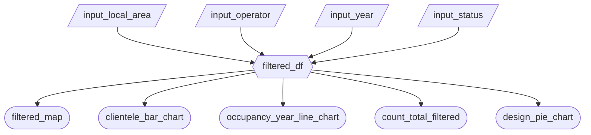

# Vancouver Non-Market Housing Dashboard App Specification - Group 20

## Component Inventory

| ID | Type | Shiny widget / renderer | Depends on | Job story |
| --- | --- | --- | --- | --- |
| `input_local_area` | Input | `ui.input_selectize` | - | 2, 3 |
| `input_operator` | Input | `ui.input_selectize` | - | 2, 3 |
| `input_status` | Input | `ui.input_checkbox` | - | 2, 3 |
| `input_year` | Input | `ui.input_slider` | - | 2, 3 |
| `filtered_df` | Reactive Calc | `@reactive.calc` | `input_local_area`, `input_operator`, `input_project_status`, `input_year` | 1, 2, 3 |
| `filtered_map` | Output | `@render_widget` | `filtered_df` | 1 |
| `count_total_filtered` | Output | `ui.value_box` | `filtered_df` | 1 |
| `clientele_bar_chart` | Output | `@render_widget` | `filtered_df` | 3 |
| `occupancy_year_line_chart` | Output | `@render_widget` | `filtered_df` | 2 |
| `design_pie_chart` | Output | `@render_widget` | `filtered_df` | 3 |

## Reactivity Diagram



`filtered_df` is a `@reactive.calc` that calls the following function:

```python
def filtered_df():
    local_area = input.input_local_area()
    operator = input.input_operator()
    year_min, year_max = input.input_year()
    status = input.input_status()

    return clean_df.query(
        "`Local Area` in @local_area & "
        "`Operator` in @operator & "
        "`Occupancy Year` >= @year_min & "
        "`Occupancy Year` <= @year_max & "
        "`Project Status` in @status"
    )
```

## Calculation Details

### `filtered_df`

The `@reactive.calc` `filtered_df` depends on the following inputs:

- `input_local_area`
- `input_operator`
- `input_year`
- `input_status`

It filters rows in the dataframe to the selected local area, operator, year of occupancy, and status.

It is consumed by the following outputs:

- `filtered_map`
- `clientele_bar_chart`
- `occupancy_year_line_chart`
- `count_total_filtered`
- `design_pie_chart`
