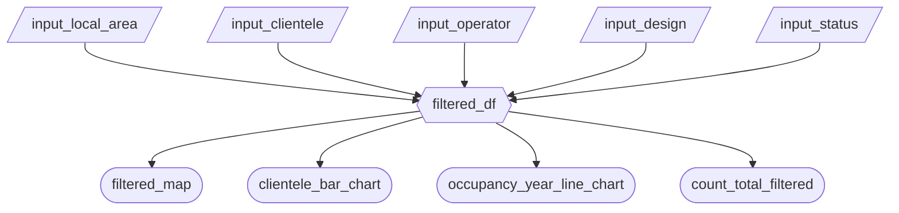

## Reactivity Diagram



`filtered_df` is a `@reactive.calc` that calls the following function:

```python
def filter_data():
    return clean_df.query(
        "`Local Area` in input.input_local_area() & "
        "`Project Status` in input.input_status() & "
        "Operator in input.input_operator() & "
        "Clientele in input.input_clientele() & "
        "Design in input.input_design()"
    )
```
